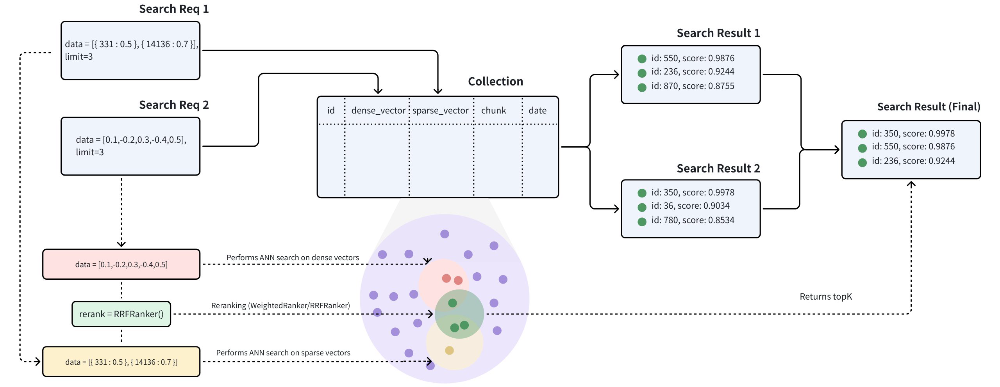

# 一、MultiHop-RAG 数据集简介

💡 MultiHop-RAG - 多文档检索增强生成评估数据集
- [github](https://github.com/yixuantt/MultiHop-RAG)
- [📄 Paper Link (Accepted by COLM 2024): MultiHop-RAG: Benchmarking Retrieval-Augmented Generation for Multi-Hop Queries](https://arxiv.org/pdf/2401.15391)

🚀 概述
MultiHop-RAG：一个用于评估跨文档检索与推理能力的问答数据集，专为包含元数据的RAG流程设计。该数据集包含2556个查询，每个查询所需的证据分散在2至4个不同文档中。查询设计还涉及文档元数据的使用，精准还原现实世界RAG应用中常见的复杂场景。


📊 多跳查询所需证据数量的分布

- 0：(null query) 301, 11.78%
- 2: 1078, 42.18%
- 3: 779, 30.48%
- 4: 398, 15.56%


🏷️ 查询类型 

- 🟦 null_query:  301,  11.77%
- 🟩 inference_query：816, 31.92%
- 🟨 comparison_query：856, 33.48%
- 🟧 temporal_query：583, 22.83%

📄 具体 query

```json
{
        "query": "Which individual is implicated in both inflating the value of a Manhattan apartment to a figure not yet achieved in New York City's real estate history, according to 'Fortune', and is also accused of adjusting this apartment's valuation to compensate for a loss in another asset's worth, as reported by 'The Age'?",
        "answer": "Donald Trump",
        "question_type": "inference_query",
        "evidence_list": [
            {
                "title": "Donald Trump defrauded banks with 'fantasy' to build his real estate empire, judge rules in a major repudiation against the former president",
                "author": "Michael R. Sisak, The Associated Press",
                "url": "https://fortune.com/2023/09/26/donald-trump-fraud-banks-insurers-real-estate-judge-new-york/",
                "source": "Fortune",
                "category": "business",
                "published_at": "2023-09-26T21:11:15+00:00",
                "fact": "No apartment in New York City has ever sold for close to that amount, James said."
            },
            {
                "title": "The $777 million surprise: Donald Trump is getting richer",
                "author": "Tom Maloney",
                "url": "https://www.theage.com.au/business/companies/the-777-million-surprise-donald-trump-is-getting-richer-20231108-p5eicf.html?ref=rss&utm_medium=rss&utm_source=rss_business",
                "source": "The Age",
                "category": "business",
                "published_at": "2023-11-07T22:22:05+00:00",
                "fact": "The prosecution argues that was to mask a drop in the value of one of his other properties."
            }
        ]
    }
```

# 二、评估体系

## 1. Retrieval 评估

**Hits@10**: 命中率指标，衡量在前10个检索结果中是否至少包含一个相关文档。对于每个查询，如果前10个结果中至少有一个相关文档（gold item），则计为命中。最终计算所有查询的命中比例。

**Hits@4**: 命中率指标，衡量在前4个检索结果中是否至少包含一个相关文档。对于每个查询，如果前4个结果中至少有一个相关文档，则计为命中。最终计算所有查询的命中比例。

**MAP@10**: Mean Average Precision at 10，平均精度均值。对于每个查询：
- 遍历前10个检索结果，当找到相关文档时，计算该位置的精度：precision_at_rank = 新找到的相关文档数 / 当前排名位置
- 累加所有相关文档位置的精度值
- 除以 min(相关文档总数, 10) 得到该查询的平均精度
- 对所有查询的平均精度求平均

**MRR@10**: Mean Reciprocal Rank at 10，平均倒数排名。对于每个查询：
- 找到第一个相关文档的排名位置（first_relevant_rank）
- 如果在前10个结果中找到相关文档，计算 1 / first_relevant_rank；如果未找到，则为0
- 对所有查询的倒数排名求平均 

## 2. QA 评估

QA 评估用于衡量模型生成答案的质量，基于预测答案与标准答案的匹配程度计算以下指标：

**Recall（召回率）**: 正确回答问题的占总问题的比例。

**评估方法**：

- 匹配判断：通过单词级别的交集判断预测答案与标准答案是否匹配（`has_intersection` 函数），由于答案非常简单，1到3个单词。这个判断标准足够了。
- 支持按问题类型（question_type）分别评估，同时提供整体评估指标


## 3. 评估参数

### 1. 模型

- Embedding Model: Qwen/Qwen3-Embedding-0.6B
- Rerank Model: Qwen/Qwen3-Reranker-0.6B
- LLM: dashscope / qwen-plus

### 2. 其他参数

- ChunkSize: 500
- ChunkOverlap: 50
- TopK: 10
- Rerank: 20 (如果激活Reranker, 获查询 2 * Topk个 Chunk, 然后Rerank 后，返回 TopK Chunk)


## 4. 评估本地环境搭建

### 1. 下载模型

```
modelscope download --model Qwen/Qwen3-Reranker-0.6B  --local-dir ./models/Qwen/Qwen3-Reranker-0.6B

modelscope download --model Qwen/Qwen3-Embedding-0.6B  --local-dir ./models/Qwen3-Embedding-0.6B
```

### 2. vllm 启动 Qwen3-Embedding-0.6B 服务：

```
python3 -m vllm.entrypoints.openai.api_server \
    --model /root/autodl-tmp/models/Qwen/Qwen3-Reranker-0.6B \
    --host 0.0.0.0 \
    --port 8090 \
    --dtype auto \
    --trust-remote-code \
    --served-model-name qwen3-reranker-0.6b \
    --gpu-memory-utilization 0.4 \
    --task score \
    --hf_overrides '{"architectures": ["Qwen3ForSequenceClassification"], "classifier_from_token": ["no", "yes"], "is_original_qwen3_reranker": true}'
```

### 3. vllm 启动 Qwen3-Embedding-0.6B 服务：

```bash
python3 -m vllm.entrypoints.openai.api_server \
    --model /root/autodl-tmp/models/Qwen/Qwen3-Embedding-0.6B \
    --host 0.0.0.0 \
    --port 8091 \
    --dtype auto \
    --trust-remote-code \
    --served-model-name qwen3-embedding-0.6b \
    --gpu-memory-utilization 0.4 \
    --task embed \
    --max-model-len 8192 
```

**注意**：如果使用本地模型路径，请替换为实际路径，例如：
```bash
--model /path/to/models/Qwen/Qwen3-Reranker-0.6B
```

### 4. 替代方案：使用 Python 启动服务

如果 vllm 有问题，可以使用项目自带的 Python reranker 和 embedding 服务：

```bash
cd plugins/golang-filter/mcp-server/servers/rag/python
python service.py
```

该服务会自动从环境变量读取配置，支持本地模型加载。

# ssh 
```
ssh -L 8090:127.0.0.1:8090 -p 38376 root@connect.nmb1.seetacloud.com
```

# 三、RAG 增强方案

## 1. baseline 和  Ground-truth QA 

Retrieval 评估
```
retrieval_default_500.json
Hits@10: 0.5876
Hits@4: 0.4293
MAP@10: 0.1656
MRR@10: 0.3401
```
base QA 评估

```
Question Type: inference_query
 Recall: 0.9301
Question Type: comparison_query
 Recall: 0.5409
Question Type: null_query
 Recall: 0.8405
Question Type: temporal_query
 Recall: 0.4871
Overall Metrics:
 Recall: 0.6882
```

Ground-truth QA

```
Question Type: inference_query
 Recall: 0.9645
Question Type: comparison_query
 Recall: 0.7033
Question Type: null_query
 Recall: 0.6844
Question Type: temporal_query
 Recall: 0.5506
Overall Metrics:
 Recall: 0.7496
```


## 1. Rerank 

```
retrieval_rerank_500.json
Hits@10: 0.6851
Hits@4: 0.5761
MAP@10: 0.2414
MRR@10: 0.4888
```

QA 评估

```
Question Type: inference_query
 Recall: 0.9485
Question Type: comparison_query
 Recall: 0.5759
Question Type: null_query
 Recall: 0.8073
Question Type: temporal_query
 Recall: 0.5009
Overall Metrics:
 Recall: 0.7050

```

## 2. 混合搜索(Hybrid Search)

### 1. 混合搜索

混合搜索通过稀疏-密集向量搜索：
- 密集向量是捕捉语义关系的绝佳方法
- 稀疏向量则是精确匹配关键词的高效方法。
- 排序支持基于 Weight 和 RRF Reranker.

混合搜索结合了这些方法，既能提供广泛的概念理解，又能提供精确的术语相关性，从而改善搜索结果。通过利用每种方法的优势，混合搜索克服了单独方法的局限性，为复杂查询提供了更好的性能。以下是结合语义搜索和全文搜索的混合检索的详细指南。

混合搜索工作流程如下：




### 2. milvus 实现

** Schema 阶段**

```golang
// content field 
fieldEntity = entity.NewField().WithName(field.RawName).
WithDataType(entity.FieldTypeVarChar).WithMaxLength(int64(maxLength))
// 增加 tokenizer 和 stop_words / lowercase filter 配置
analyzerParams := map[string]any{
    "tokenizer": "standard",
    "filter": []any{
        "lowercase",
        map[string]any{
            "type":       "stop",
            "stop_words": STOPWORDS,
        },
    },
}
fieldEntity.WithEnableAnalyzer(true).WithAnalyzerParams(analyzerParams)
schema.WithField(fieldEntity)

// 添加 sparse vector field
sparseVectorField, _ := m.mapper.GetSparseVectorField()
textField, _ := m.mapper.GetRawField("content")
// Add bm25 function
function := entity.NewFunction().WithName("text_bm25_emb").
    WithInputFields(textField.RawName).
    WithOutputFields(sparseVectorField.RawName).
    WithType(entity.FunctionTypeBM25)
// Add sparse vector field
sparseVectorField := entity.NewField().
    WithName(sparseVectorField.RawName).
    WithDataType(entity.FieldTypeSparseVector).
    WithDescription("BM25 sparse vector field for hybrid search")

schema.WithField(sparseVectorField).WithFunction(function)
```

** Search 阶段**

```golang
outputFields, _ := m.mapper.GetOutputFields()
vectorField, _ := m.mapper.GetVectorField()
sparseVectorField, _ := m.mapper.GetSparseVectorField()

// Build vector search request
request1 := milvusclient.NewAnnRequest(vectorField.RawName, options.TopK, entity.FloatVector(vector))

// Build sparse vector search request
annParam := index.NewSparseAnnParam()
annParam.WithDropRatio(0.2)
request2 := milvusclient.NewAnnRequest(sparseVectorField.RawName, options.TopK, entity.Text(query)).WithAnnParam(annParam)

// Build reranker based on configuration
var reranker milvusclient.Reranker
switch m.config.HybridSearch.Ranker {
case config.WeightedRanker:
    // Use weighted reranker with configured vector weight
    vectorWeight := m.config.HybridSearch.VectorWeight
    if vectorWeight <= 0 {
        vectorWeight = 0.5 // Default weight
    }
    reranker = milvusclient.NewWeightedReranker([]float64{vectorWeight, 1.0 - vectorWeight})
default:
    // Default to RRF reranker
    reranker = milvusclient.NewRRFReranker()
}

// Perform hybrid search
searchResults, err := m.client.HybridSearch(ctx, milvusclient.NewHybridSearchOption(
    m.collection,
    options.TopK,
    request1,
    request2,
).WithReranker(reranker).WithOutputFields(outputFields...))

```


Retrieval 评估
```
retrieval_hybrid_500.json
Hits@10: 0.7020
Hits@4: 0.5353
MAP@10: 0.2033
MRR@10: 0.4063
```

QA 评估
```
Question Type: inference_query
 Recall: 0.9534
Question Type: comparison_query
 Recall: 0.5853
Question Type: null_query
 Recall: 0.8306
Question Type: temporal_query
 Recall: 0.4957
Overall Metrics:
 Recall: 0.7113
```

## 3. ChainOfRAG