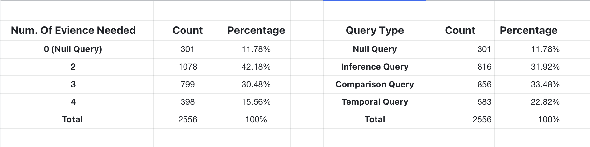
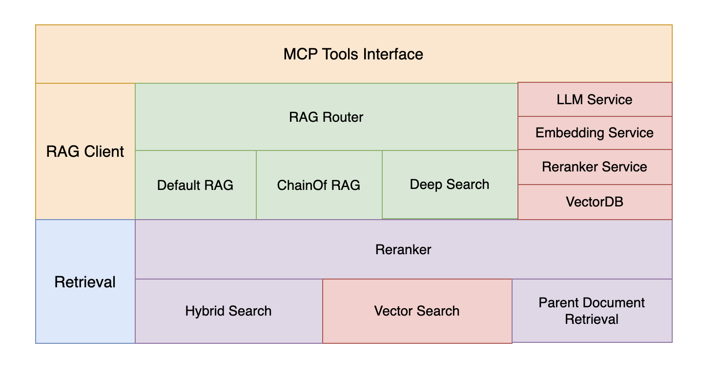
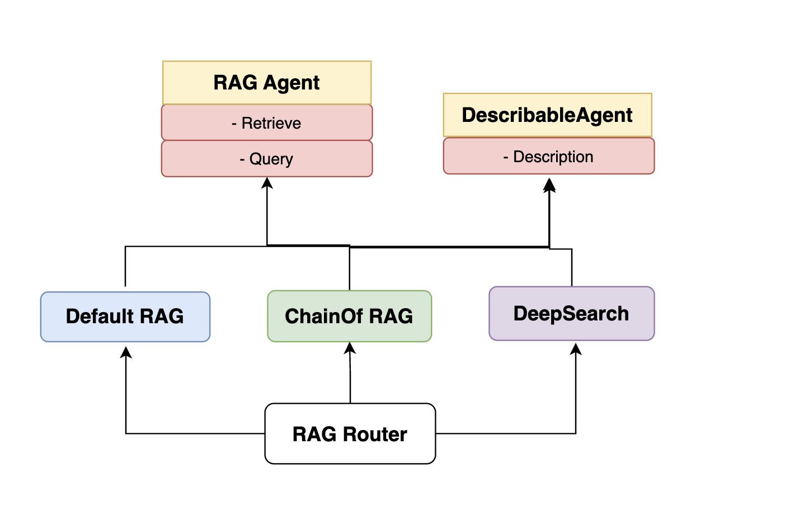
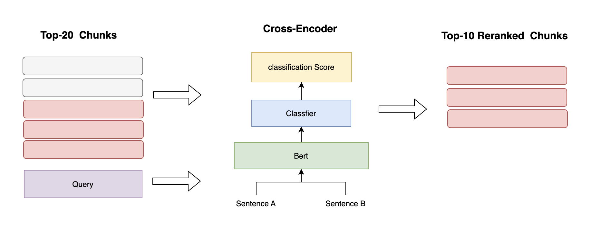
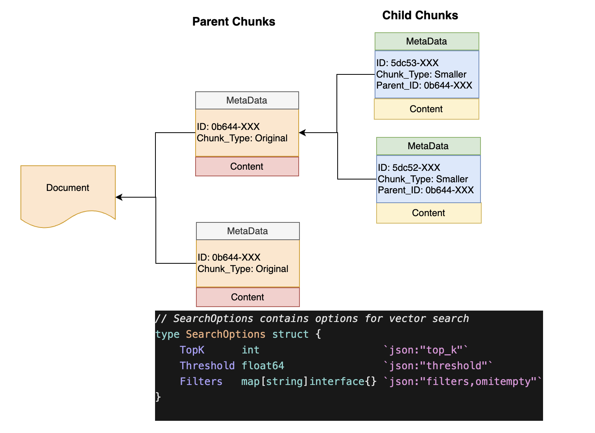
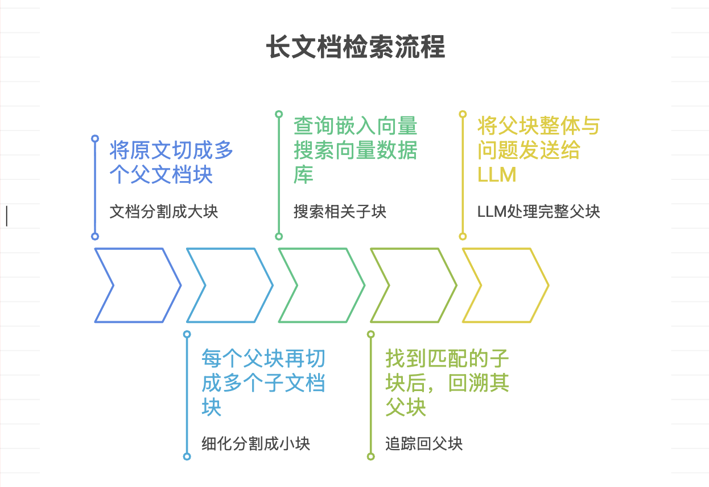
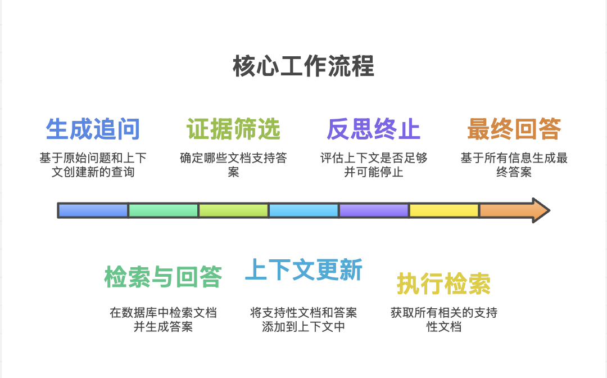
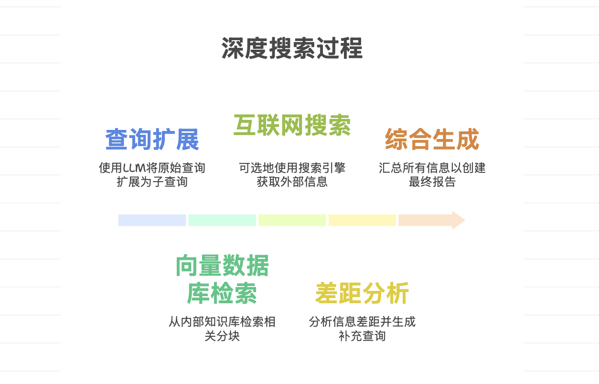

# 团队和代码

## 1. 团队和成员

- 团队名称： 2456868764
- Jun： 独立开发者

## 2. 代码

- https://github.com/2456868764/higress.git
- branch:  feat-competition


# 一、MultiHop-RAG 数据集简介

💡 MultiHop-RAG - 多文档检索增强生成评估数据集
- [github](https://github.com/yixuantt/MultiHop-RAG)
- [📄 Paper Link (Accepted by COLM 2024): MultiHop-RAG: Benchmarking Retrieval-Augmented Generation for Multi-Hop Queries](https://arxiv.org/pdf/2401.15391)

🚀 概述
MultiHop-RAG：一个用于评估跨文档检索与推理能力的问答数据集，专为包含元数据的RAG流程设计。该数据集来源609个语料文档和2556个查询，每个查询所需的证据分散在2至4个不同文档中。查询设计还涉及文档元数据的使用，精准还原现实世界RAG应用中常见的复杂场景。


📊 多跳查询所需证据数量的分布

| 证据数量 | 查询数量 | 占比 | 说明 |
|---------|---------|------|------|
| **0** | 301 | 11.78% | null query（无需检索即可回答） |
| **2** | 1,078 | 42.18% | 需要 2 个文档作为证据 |
| **3** | 779 | 30.48% | 需要 3 个文档作为证据 |
| **4** | 398 | 15.56% | 需要 4 个文档作为证据 |
| **总计** | **2,556** | **100%** | 数据集总查询数 |

🏷️ 查询类型分布

| 查询类型 | 数量 | 占比 | 说明 |
|---------|------|------|------|
| 🟦 **null_query** | 301 | 11.78% | 无需检索即可回答的简单查询 |
| 🟩 **inference_query** | 816 | 31.92% | 需要推理的多跳查询 |
| 🟨 **comparison_query** | 856 | 33.48% | 需要对比分析的查询 |
| 🟧 **temporal_query** | 583 | 22.82% | 涉及时间关系的查询 |
| **总计** | **2,556** | **100%** | 数据集总查询数 |

分布如下图： 



📄 具体 query

```json
{
        "query": "Which individual is implicated in both inflating the value of a Manhattan apartment to a figure not yet achieved in New York City's real estate history, according to 'Fortune', and is also accused of adjusting this apartment's valuation to compensate for a loss in another asset's worth, as reported by 'The Age'?",
        "answer": "Donald Trump",
        "question_type": "inference_query",
        "evidence_list": [
            {
                "title": "Donald Trump defrauded banks with 'fantasy' to build his real estate empire, judge rules in a major repudiation against the former president",
                "author": "Michael R. Sisak, The Associated Press",
                "url": "https://fortune.com/2023/09/26/donald-trump-fraud-banks-insurers-real-estate-judge-new-york/",
                "source": "Fortune",
                "category": "business",
                "published_at": "2023-09-26T21:11:15+00:00",
                "fact": "No apartment in New York City has ever sold for close to that amount, James said."
            },
            {
                "title": "The $777 million surprise: Donald Trump is getting richer",
                "author": "Tom Maloney",
                "url": "https://www.theage.com.au/business/companies/the-777-million-surprise-donald-trump-is-getting-richer-20231108-p5eicf.html?ref=rss&utm_medium=rss&utm_source=rss_business",
                "source": "The Age",
                "category": "business",
                "published_at": "2023-11-07T22:22:05+00:00",
                "fact": "The prosecution argues that was to mask a drop in the value of one of his other properties."
            }
        ]
    }
```

# 二、评估体系

## 1. Retrieval 评估

Retrieval 评估用于衡量检索系统找到相关文档的能力，主要指标如下：

| 指标 | 全称 | 计算方法 | 说明 |
|------|------|---------|------|
| **Hits@10** | Hit Rate at 10 | 前10个结果中至少包含1个相关文档的查询比例 | 衡量检索的召回能力 |
| **Hits@4** | Hit Rate at 4 | 前4个结果中至少包含1个相关文档的查询比例 | 衡量Top-K检索的精确度 |
| **MAP@10** | Mean Average Precision at 10 | 对每个查询计算平均精度，然后对所有查询求平均 | 综合考虑检索的准确性和排序质量 |
| **MRR@10** | Mean Reciprocal Rank at 10 | 对每个查询计算第一个相关文档的倒数排名，然后求平均 | 衡量相关文档的排名位置，值越大说明相关文档越靠前 | 

## 2. QA 评估

QA 评估用于衡量模型生成答案的质量，基于预测答案与标准答案的匹配程度进行评估。

### 2.1 评估指标

| 指标 | 说明 | 计算方法 |
|------|------|---------|
| **Recall（召回率）** | 正确回答问题的查询占总查询的比例 | 预测答案与标准答案匹配的查询数 / 总查询数 |

### 2.2 评估方法

**匹配判断**：
- 使用单词级别的交集判断预测答案与标准答案是否匹配（`has_intersection` 函数）
- 由于答案通常非常简单（1-3个单词），该判断标准足够准确

**评估粒度**：
- 支持按问题类型（`question_type`）分别评估：`inference_query`、`comparison_query`、`null_query`、`temporal_query`
- 同时提供整体评估指标（Overall Metrics）


## 3. 实验参数

### 3.1 模型配置

| 模型类型 | 模型名称 | 说明 |
|---------|---------|------|
| **Embedding Model** | Qwen/Qwen3-Embedding-0.6B | 用于将查询和文档转换为向量表示，支持语义相似度计算 |
| **Rerank Model** | Qwen/Qwen3-Reranker-0.6B | 用于对检索结果进行精排序，提升检索精度 |
| **LLM** | dashscope / qwen-plus | 用于数据召回后答案的生成 |
|         | Deepseek  / deepseek-reasoner | 用于 ChainOf RAG Agent 推理 |

### 3.2 文本切分参数

| 参数名称 | 值 | 说明 |
|---------|-----|------|
| **ChunkSize** | 500 | 文档切分的基础块大小（字符数） |
| **ChunkOverlap** | 50 | 相邻块之间的重叠字符数，保证上下文连续性 |
| **SmallChunkSize** | 250 | 小块的切分大小，用于 Parent Document Retriever 的子文档切分 |

### 3.3 检索参数

| 参数名称 | 值 | 说明 |
|---------|-----|------|
| **TopK** | 10 | 检索返回的 Top-K 个最相关文档 |
| **RerankTopK** | 20 | 如果启用 Reranker，先检索 2 × TopK 个候选文档，然后 Rerank 后返回 TopK 个文档 |

**注意**：当启用 Reranker 时，检索流程为：
1. 向量检索获取 `RerankTopK` (20) 个候选文档
2. Rerank 模型对候选文档进行精排序
3. 返回排序后的 TopK (10) 个文档


## 4. 评估流程和工具

RAG 系统评估采用**两阶段评估**流程：**Retrieval 评估**和 **QA 评估**。整个评估流程包含 4 个核心步骤，从数据索引到最终答案评估。

### 4.1 评估流程概览

```
数据索引 →→→→   批量检索 →→→→   答案生成 →→→→   结果评估
   ↓             ↓               ↓             ↓
index.py  batch-retrieval(go)  qa_llm.py  retrieval_evaluate.py
   ↓             ↓               ↓          qa_evaluate.py
```

### 4.2 详细步骤说明

#### 步骤 1: 数据索引 (Indexing)

**工具**: `python/index.py`

**功能**: 将原始文档切分、向量化并索引到 Milvus 向量数据库

**使用方法**:
```bash
cd plugins/golang-filter/mcp-server/servers/rag
python python/index.py \
  --corpus_file dataset/corpus.json \
  --collection_name corpus_collection_500 \
  --chunk_size 500 \
  --chunk_overlap 50
```

**关键参数**:
- `--corpus_file`: 输入数据集文件路径
- `--collection_name`: Milvus 集合名称
- `--chunk_size`: 文档切分大小（默认 500）
- `--chunk_overlap`: 块重叠大小（默认 50）

#### 步骤 2: 批量检索 (Batch Retrieval)

**工具**: `cmd/batch-retrieval/main.go`

**功能**: 对测试集中的所有查询进行批量检索，生成检索结果文件

**使用方法**:
```bash
cd plugins/golang-filter/mcp-server/servers/rag
go run cmd/batch-retrieval/main.go \
  -input=python/dataset/MultiHopRAG.json \
  -output=python/output/retrieval_default_500.json \
  -collection=corpus_collection_500 \
  -agent=default \
  -topk=10 \
  -threshold=0.0 \
  -rerank=false \
  -hybrid_search=false \
  -workers=5
```

**关键参数**:
| 参数 | 说明 | 默认值 |
|------|------|--------|
| `-input` | 输入查询数据集文件 | `dataset/MultiHopRAG.json` |
| `-output` | 输出检索结果文件 | `output/retrieval_*.json` |
| `-agent` | RAG Agent 类型 (`default`, `chain_of_rag`, `deep_search`, `router`) | `default` |
| `-topk` | 返回的 Top-K 结果数量 | `10` |
| `-threshold` | 相似度分数阈值 | `0.0` |
| `-rerank` | 是否启用 Reranker | `false` |
| `-rerank_topk` | Rerank 前检索的候选数量 | `20` |
| `-workers` | 并发 worker 数量（0 或 1 表示串行） | `1` |
| `-max_query` | 最大处理查询数量（0 表示无限制） | `0` |
| `-hybrid_search` | 是否启用混合搜索 | `false` |
| `-collection` | Milvus 集合名称 | `corpus_collection_500` |


#### 步骤 3: 答案生成 (Answer Generation)

**工具**: `python/qa_llm.py`

**功能**: 基于检索结果，使用 LLM 生成答案

**使用方法**:
```bash
cd plugins/golang-filter/mcp-server/servers/rag
python python/qa_llm.py \
  --input ./python/output/retrieval_default_500.json \
  --output ./python/qa_output/qa_default_500.json \
  --model qwen-plus \
  --temperature 0.3 \
  --max-tokens 512 \
  --max-workers 10
```

**关键参数**:
- `--input`: 检索结果文件路径（步骤 2 的输出）
- `--output`: QA 答案输出文件路径
- `--model`: LLM 模型名称（如 `qwen-plus`, `gpt-4o`）
- `--temperature`: 生成温度参数（默认 0.3）
- `--max-tokens`: 最大生成 token 数（默认 512）
- `--max-workers`: 并发 LLM 调用数量（默认 10）

#### 步骤 4: 结果评估 (Evaluation)

##### 4.4.1 Retrieval 评估

**工具**: `python/retrieval_evaluate.py`

**功能**: 评估检索结果的质量，计算 Hits@10、Hits@4、MAP@10、MRR@10 等指标

**使用方法**:
```bash
cd plugins/golang-filter/mcp-server/servers/rag
python python/retrieval_evaluate.py \
  --file ./python/output/retrieval_default_500.json
```


##### 4.4.2 QA 评估

**工具**: `python/qa_evaluate.py`

**功能**: 评估生成答案的质量，计算 Recall 指标

**使用方法**:
```bash
cd plugins/golang-filter/mcp-server/servers/rag
python python/qa_evaluate.py \
  --qa-output ./python/qa_output/default_500.json \
  --dataset ./python/dataset/MultiHopRAG.json
```


## 5. 评估本地环境搭建

### 1. 下载模型

```
modelscope download --model Qwen/Qwen3-Reranker-0.6B  --local-dir ./models/Qwen/Qwen3-Reranker-0.6B

modelscope download --model Qwen/Qwen3-Embedding-0.6B  --local-dir ./models/Qwen3-Embedding-0.6B
```

### 2. vllm 启动 Qwen3-Embedding-0.6B 服务：

```
python3 -m vllm.entrypoints.openai.api_server \
    --model /root/autodl-tmp/models/Qwen/Qwen3-Reranker-0.6B \
    --host 0.0.0.0 \
    --port 8090 \
    --dtype auto \
    --trust-remote-code \
    --served-model-name qwen3-reranker-0.6b \
    --gpu-memory-utilization 0.4 \
    --task score \
    --hf_overrides '{"architectures": ["Qwen3ForSequenceClassification"], "classifier_from_token": ["no", "yes"], "is_original_qwen3_reranker": true}'
```

### 3. vllm 启动 Qwen3-Embedding-0.6B 服务：

```bash
python3 -m vllm.entrypoints.openai.api_server \
    --model /root/autodl-tmp/models/Qwen/Qwen3-Embedding-0.6B \
    --host 0.0.0.0 \
    --port 8091 \
    --dtype auto \
    --trust-remote-code \
    --served-model-name qwen3-embedding-0.6b \
    --gpu-memory-utilization 0.4 \
    --task embed \
    --max-model-len 8192 
```

**注意**：如果使用本地模型路径，请替换为实际路径，例如：
```bash
--model /path/to/models/Qwen/Qwen3-Reranker-0.6B
```

### 4. 替代方案：使用 Python 启动服务

如果 vllm 有问题，可以使用项目自带的 Python reranker 和 embedding 服务：

```bash
cd plugins/golang-filter/mcp-server/servers/rag/python
python service.py
```

该服务会自动从环境变量读取配置，支持本地模型加载。


# 三、RAG 增强方案和评估

## 1. 增强方案概述

### 1.1 架构设计

整体 RAG 系统采用四层架构设计：

1. **MCP Tool Interface**：提供标准化的工具接口
2. **RAG Client**：核心 RAG 逻辑层，支持多种 Agent 策略
3. **Retrieval**：检索增强层，支持多种检索优化技术
4. **VectorDB**: Milvus 向量数据库

架构图如下：



### 1.2 增强技术列表

#### Retrieval 层增强
- **Reranker**：基于 Cross-Encoder 的精排序模型，提升检索精度
- **Hybrid Search**：结合 Dense 和 Sparse 向量的混合检索
- **Parent Document Retriever**：索引子块、召回父块的检索策略

#### RAG Client 层增强

RAG Client 层采用 **Agent 模式**设计，通过统一的接口抽象和灵活的路由机制，支持多种 RAG 策略的动态选择和组合。

##### Agent 接口设计

1. **RAGAgent**：定义了 RAG 专用的两个核心方法
   ```go
   type RAGAgent interface {
       // Retrieve: 检索相关文档
       Retrieve(ctx context.Context, query string, kwargs map[string]interface{}) 
           ([]RetrievalResult, int, map[string]interface{}, error)
       // Query: 执行查询并生成答案
       Query(ctx context.Context, query string, kwargs map[string]interface{}) 
           (string, []RetrievalResult, int, error)
   }
   ```

2. **DescribableAgent**：可选接口，用于为 Router 提供 Agent 描述
   ```go
   type DescribableAgent interface {
       Description() string
   }
   ```

##### Agent 接口设计原理



##### Agent 实现

系统提供了三种核心 Agent 实现：

| Agent | 适用场景 | 核心特点 |
|-------|---------|---------|
| **DefaultRAG** | 简单事实查询、单跳问题 | 基础的检索-生成流程，支持 Reranker 和 Hybrid Search |
| **ChainOfRAG** | 复杂多跳查询、需要迭代推理 | 迭代分解查询，逐步检索和推理，支持提前终止 |
| **DeepSearch** | 主题报告、综合性调查 | 查询扩展、多源检索（向量库+互联网）、Gap Analysis |

##### Router 机制

**RAGRouter** 是一个智能分发器，负责根据查询特点将请求路由到最合适的 Agent：

1. **意图识别**：利用 LLM 分析用户查询的意图和复杂度
2. **动态路由**：根据预定义的 Agent 描述，选择最匹配的 Agent
3. **灵活扩展**：支持注册任意实现了 `RAGAgent` 接口的新 Agent


## 2. 增强方案评估

### 2.1 Retrieval 评估结果对比

| 方案 | 数据文件 | Hits@10 | Hits@4 | MAP@10 | MRR@10 | 提升幅度 |
|------|---------|---------|--------|--------|--------|---------|
| **Baseline** | retrieval_default_500.json | 0.5876 | 0.4293 | 0.1656 | 0.3401 | - |
| **Reranker** | retrieval_rerank_500.json | 0.6851 | 0.5761 | 0.2414 | 0.4888 | +16.6% Hits@10 |
| **Hybrid Search** | retrieval_hybrid_500.json | 0.7020 | 0.5353 | 0.2033 | 0.4063 | +19.5% Hits@10 |


**评估结论**：
- **Reranker** 显著提升了检索精度，Hits@10 提升 16.6%，MAP@10 提升 45.8%
- **Hybrid Search** 在 Hits@10 上表现最佳（0.7020），但 MAP@10 略低于 Reranker
- 两种增强方案在 MRR@10 上都有显著提升，说明相关文档的排名位置更靠前

### 2.2 QA 评估结果对比

#### 2.2.1 按问题类型的 Recall 对比

| 问题类型 | Baseline | Reranker | Hybrid Search | ChainOfRAG | Ground-truth | 最佳方案 |
|---------|----------|----------|---------------|------------|--------------|---------|
| **inference_query** | 0.9301 | 0.9485 | 0.9534 | **0.9681** | 0.9645 | **ChainOfRAG** |
| **comparison_query** | 0.5409 | 0.5759 | 0.5853 | 0.5700 | 0.7033 | Hybrid Search |
| **null_query** | 0.8405 | 0.8073 | 0.8306 | **0.9000** | 0.6844 | **ChainOfRAG** |
| **temporal_query** | 0.4871 | 0.5009 | 0.4957 | **0.5152** | 0.5506 | **ChainOfRAG**  |
| **Overall Recall** | **0.6882** | **0.7050** | **0.7113** | **0.7267** | **0.7496** | **ChainOfRAG** |

** 现在ChainofRAG 评估 800个问题， 整个测试集跑一遍需要2000万以上TOKEN.

#### 2.2.2 整体性能分析

**Baseline (默认检索)**
- 整体 Recall: **0.6882**
- 劣势：comparison_query 和 temporal_query 表现较弱

**Reranker (重排序)**
- 整体 Recall: **0.7050** (+2.4%)
- 优势：在所有复杂查询类型上都有提升，temporal_query 提升最明显
- 适用场景：需要高精度检索的场景

**Hybrid Search (混合搜索)**
- 整体 Recall: **0.7113** (+3.4%)
- 优势：在 inference_query 和 comparison_query 上表现较佳
- 适用场景：查询需要精确匹配的场景

**ChainOfRAG (链式检索增强生成)**
- 整体 Recall: **0.7267** (+5.6%)
- 优势：
  - **inference_query 表现最佳**（0.9681），显著优于其他方案
  - **null_query 表现优异**（0.9000），接近 Baseline 水平
  - **temporal_query 表现优异**（0.5152）
  - 通过迭代分解和逐步推理，能够处理复杂的多跳查询
- 劣势
  - 需要消耗 3-5 倍 Token  
- 适用场景：需要多步推理的复杂查询、多跳问答场景
- 特点：通过迭代检索和反思机制，能够逐步收集信息并生成高质量答案

**Ground-truth (标准答案)**
- 整体 Recall: **0.7496**
- 说明：即使使用标准答案，Recall 也仅为 0.7496，说明数据集本身具有一定挑战性
- 差距：当前最佳方案（ChainOfRAG）与 Ground-truth 差距为 2.3%


# 四、RAG 增强方案细节

## 1. Reranker (重排序)

### 痛点分析
传统的向量检索 (Embedding Retrieval) 虽然擅长捕捉语义相关性，但存在以下局限：
- **粗粒度**：Bi-Encoder 架构在处理细微语义差异时精度不足。
- **Top-K 噪声**：召回结果中常包含相关但非关键的文档，直接输入 LLM 会引入噪声。

### 解决方案
**Reranker** 引入了 Cross-Encoder 架构的精排模型，位于检索 (Retrieval) 和 生成 (Generation) 之间：
1. **粗召回**：先通过向量检索获取 Top-N (如 20) 个候选文档。
2. **精排序**：使用 Rerank 模型对 Query 和每个候选文档进行深度的逐对评分。
3. **截断**：根据评分重新排序，仅保留 Top-K (如 5) 个最高分文档传给 LLM。

### 核心优势
- **精准度大幅提升**：Cross-Encoder 能捕捉查询与文档间复杂的交互语义，显著优于单纯的向量相似度。
- **优化 LLM 性能**：通过过滤噪声文档，减少了 Token 消耗，并缓解了 "Lost in the Middle" 现象。
- **即插即用**：作为独立模块，可轻松集成到现有的 RAG 流程中，无需重新索引向量库。

### 原理如图



## 2. Hybrid Search(混合搜索)

### 痛点分析
单一的检索方式往往存在局限性：
- **语义检索 (Dense Retrieval)**：基于 Embedding，擅长捕捉语义关系和概念匹配，但容易忽略精确的关键词（如专有名词、型号等）。
- **关键词检索 (Sparse Retrieval)**：基于 BM25/TF-IDF，擅长精确匹配特定术语，但无法理解上下文语义和同义词。

### 解决方案
**混合搜索 (Hybrid Search)** 结合了稀疏向量和密集向量的优势，同时进行语义理解和精确匹配，显著提升检索的综合性能。

1. **双路召回**：
   - **密集向量路径 (Dense)**：将 Query 转换为 Embedding 向量，捕捉语义相似度。
   - **稀疏向量路径 (Sparse)**：使用 BM25 等算法提取关键词特征，进行精确匹配。
2. **结果融合 (Rerank)**：
   - **Weighted Sorting**：对两路结果分配权重（如 0.5:0.5）进行加权求和。
   - **RRF (Reciprocal Rank Fusion)**：倒数排名融合，不依赖具体分数，仅根据排名进行稳健的结果合并。

### 架构图解


### 核心优势
- **互补性强**：既能理解概念（语义），又能精准定位专有名词（关键词）。
- **适应性广**：适用于既包含通用描述又包含特定专业术语的复杂查询场景。
- **鲁棒性高**：通过 RRF 等融合算法，降低了单一模型失效带来的风险。

### Milvus 实现细节

**1. Schema 定义阶段**
定义 Dense Vector (Embedding) 和 Sparse Vector (BM25) 字段，并配置 Analyzer。
```golang
// content field 
fieldEntity = entity.NewField().WithName(field.RawName).
WithDataType(entity.FieldTypeVarChar).WithMaxLength(int64(maxLength))
// 增加 tokenizer 和 stop_words / lowercase filter 配置
analyzerParams := map[string]any{
    "tokenizer": "standard",
    "filter": []any{
        "lowercase",
        map[string]any{
            "type":       "stop",
            "stop_words": STOPWORDS,
        },
    },
}
fieldEntity.WithEnableAnalyzer(true).WithAnalyzerParams(analyzerParams)
schema.WithField(fieldEntity)
// 添加 sparse vector field
sparseVectorField, _ := m.mapper.GetSparseVectorField()
textField, _ := m.mapper.GetRawField("content")
// Add bm25 function
function := entity.NewFunction().WithName("text_bm25_emb").
    WithInputFields(textField.RawName).
    WithOutputFields(sparseVectorField.RawName).WithType(entity.FunctionTypeBM25)
// Add sparse vector field
sparseVectorField := entity.NewField().WithName(sparseVectorField.RawName).
    WithDataType(entity.FieldTypeSparseVector).
    WithDescription("sparse vector field")
schema.WithField(sparseVectorField).WithFunction(function)
```

**2. Search 执行阶段**
并行执行两路搜索，并使用 Reranker 进行结果融合。
```golang
outputFields, _ := m.mapper.GetOutputFields()
vectorField, _ := m.mapper.GetVectorField()
sparseVectorField, _ := m.mapper.GetSparseVectorField()
// Build vector search request
request1 := milvusclient.NewAnnRequest(vectorField.RawName, options.TopK, 
                                       entity.FloatVector(vector))
// Build sparse vector search request  
annParam := index.NewSparseAnnParam()
annParam.WithDropRatio(0.2)
request2 := milvusclient.NewAnnRequest(sparseVectorField.RawName, options.TopK, 
                                   entity.Text(query)).WithAnnParam(annParam)
// Build reranker based on configuration
var reranker milvusclient.Reranker
switch m.config.HybridSearch.Ranker {
case config.WeightedRanker:
    // Use weighted reranker with configured vector weight
    vectorWeight := m.config.HybridSearch.VectorWeight
    if vectorWeight <= 0 {
        vectorWeight = 0.5 // Default weight
    }
    reranker = milvusclient.NewWeightedReranker([]float64{vectorWeight, 1.0 - vectorWeight})
default:
    // Default to RRF reranker
    reranker = milvusclient.NewRRFReranker()
}
// Perform hybrid search
searchResults, err := m.client.HybridSearch(ctx, milvusclient.NewHybridSearchOption(
    m.collection,options.TopK,
    request1,request2,
).WithReranker(reranker).WithOutputFields(outputFields...))
```


## 3. Parent Document Retriever (父文档检索)

### 痛点分析
在传统的 RAG 流程中，通常存在**检索粒度与上下文信息完整性的矛盾**：
- **小块切分 (Small Chunks)**：Embedding 语义匹配更精准，但丢失了上下文信息，导致 LLM 难以进行深度推理。
- **大块切分 (Large Chunks)**：包含丰富的上下文信息，但 Embedding 语义被稀释，导致检索准确率下降。
- **跨段推理需求**：复杂问题往往需要结合跨段落的信息才能回答，单一的小切片无法满足需求。

### 解决方案
**Parent Document Retriever** 通过"索引子块，召回父块"的策略，完美平衡了检索准确率与上下文完整性：

1. **索引阶段 (Indexing)**：
   - **切分父文档 (Parent Chunking)**：将原始文档切分为较大的父文档块（保留完整上下文）。
   - **生成子文档 (Child Chunking)**：将每个父文档块进一步切分为多个小的子文档块（用于精准匹配）。
   - **建立映射**：每个子文档块 Parent_ID 与父文档块的 ID 建立映射关系，并将子文档块的向量存入向量数据库。

2. **检索阶段 (Retrieval)**：
   - **子块匹配**：利用 Query Embedding 在向量数据库中检索最相关的子文档块（利用小块的高精准度）。
   - **父块回溯**：通过子块的 Parent_ID 映射，自动回溯并召回其对应的完整父文档块。

3. **生成阶段 (Generation)**：
   - **上下文增强**：将召回的完整父文档块作为 Context 发送给 LLM，提供充足的上下文信息以支持更复杂的推理和生成。

### 设计原理如下：



### 流程图如下


### 核心优势
- **精准定位**：利用小块向量化匹配，保持高精度的检索能力。
- **完整上下文**：匹配后自动扩展为父文档，为 LLM 提供连贯、丰富的信息环境。
- **支持复杂推理**：通过提供完整的上下文窗口，显著提升了模型处理多跳问答（Multi-hop QA）和跨段落推理的能力。


## 4. ChainOfRAG(链式检索增强生成)

ChainOfRAG (链式检索增强生成) 是一种通过迭代检索和推理解决复杂多跳问题的 Agent。

### 核心机制
- **迭代分解**：将复杂查询分解为一系列简单的子查询。
- **逐步推理**：针对每个子查询进行检索和回答，利用中间结果生成后续查询。
- **动态终止**：通过自我反思（Reflection）机制判断当前收集的信息是否足以回答原始问题，若足够则提前终止，否则继续迭代。

### 适用场景
- **多跳问答 (Multi-hop QA)**：需要结合多个文档中的事实才能回答的问题。
- **复杂事实查询**：单一检索无法覆盖所有必要信息的场景。

### 核心流程 (Core Workflow)

**1. Retrieve (检索阶段)**
该阶段通过迭代循环执行，直到达到最大迭代次数或满足提前终止条件：
1. **生成追问 (Sub-query Generation)**：基于原始问题和已有的中间上下文 (Intermediate Context)，利用 LLM 生成一个新的简单追问 (Follow-up Query)。
2. **检索与回答 (Retrieval & Answering)**：
   - 使用追问在向量数据库中检索 Top-K 文档。
   - 基于检索到的文档，利用 LLM 生成该追问的中间答案 (Intermediate Answer)。
3. **证据筛选 (Evidence Filtering)**：让 LLM 判断检索到的文档中哪些实际支持了该中间答案，只保留有效的支持性文档。
4. **上下文更新 (Context Update)**：将有效的支持性文档加入结果集，将"追问-中间答案"对加入中间上下文。
5. **反思终止 (Reflection & Early Stopping)**：(可选) 让 LLM 判断当前的中间上下文是否已足够回答原始问题，若足够则提前结束循环。

**2. Query (生成阶段)**
1. **执行 Retrieve**：获取所有相关的支持性文档和完整的中间推理链 (Intermediate Context)。
2. **最终回答 (Final Answer)**：将原始问题、所有支持性文档、以及中间推理链一并提交给 LLM，生成最终的综合回答。

### 架构图解


### 执行日志

```
[ChainOfRAG] ===== Starting Retrieve Phase =====
[ChainOfRAG] Original query: Does the TechCrunch article on Twitch's subscription revenue split policy indicate a different monetization strategy compared to the TechCrunch article on Beeper's plans for Beeper Mini subscriptions?
[ChainOfRAG] Max iterations: 3, Early stopping: true
[ChainOfRAG] TopK: 10, Threshold: 0.00

[ChainOfRAG] --- Iteration 1/3 ---
[ChainOfRAG] Step 1: Generating follow-up query...
[ChainOfRAG]   Generated follow-up query: What does the TechCrunch article say about Twitch's subscription revenue split policy?
[ChainOfRAG]   Tokens used: 172
[ChainOfRAG] Step 2: Retrieving documents and generating intermediate answer...
[ChainOfRAG]   Query: What does the TechCrunch article say about Twitch's subscription revenue split policy?
[ChainOfRAG]   TopK: 10, Threshold: 0.00
[ChainOfRAG]   Retrieved 10 documents from vector DB
[ChainOfRAG]   After deduplication: 10 documents
[ChainOfRAG]   Intermediate answer: Twitch ended the 70/30 subscription revenue split for select streamers, reverting to a 50/50 split and prioritizing ad revenue. It later launched the Partner Plus program, offering a 70/30 split on the first $100,000 in subscriptions for eligible creators, but the strict requirements excluded most streamers, straining relations with the community.
[ChainOfRAG]   Tokens used: 897
[ChainOfRAG] Step 3: Filtering supported documents...
[ChainOfRAG]   Input documents: 10
[ChainOfRAG]   Selected document indices: [1 9]
[ChainOfRAG]   Filtered to 2 supported documents
[ChainOfRAG]   Tokens used: 877
[ChainOfRAG]   Accumulated documents: 2
[ChainOfRAG]   Accumulated intermediate contexts: 1
[ChainOfRAG]   Total tokens used so far: 1946
[ChainOfRAG] Step 4: Checking if enough information gathered...
[ChainOfRAG]   Intermediate contexts: 1
[ChainOfRAG]   Reflection result: No (hasEnoughInfo: false)
[ChainOfRAG]   Tokens used: 223

[ChainOfRAG] --- Iteration 2/3 ---
[ChainOfRAG] Step 1: Generating follow-up query...
[ChainOfRAG]   Previous intermediate contexts: 1
[ChainOfRAG]   Generated follow-up query: What does the TechCrunch article say about Beeper's monetization strategy for Beeper Mini subscriptions?
[ChainOfRAG]   Tokens used: 285
[ChainOfRAG] Step 2: Retrieving documents and generating intermediate answer...
[ChainOfRAG]   Query: What does the TechCrunch article say about Beeper's monetization strategy for Beeper Mini subscriptions?
[ChainOfRAG]   TopK: 10, Threshold: 0.00
[ChainOfRAG]   Retrieved 10 documents from vector DB
[ChainOfRAG]   After deduplication: 10 documents
[ChainOfRAG]   Intermediate answer: Beeper Mini is priced at $1.99 per month with a seven-day free trial, though it has been made free temporarily due to instability. Subscriptions will resume once the service stabilizes.
[ChainOfRAG]   Tokens used: 1122
[ChainOfRAG] Step 3: Filtering supported documents...
[ChainOfRAG]   Input documents: 10
[ChainOfRAG]   Selected document indices: [1 2 4]
[ChainOfRAG]   Filtered to 3 supported documents
[ChainOfRAG]   Tokens used: 1105
[ChainOfRAG]   Accumulated documents: 5
[ChainOfRAG]   Accumulated intermediate contexts: 2
[ChainOfRAG]   Total tokens used so far: 4681
[ChainOfRAG] Step 4: Checking if enough information gathered...
[ChainOfRAG]   Intermediate contexts: 2
[ChainOfRAG]   Reflection result: Yes (hasEnoughInfo: true)
[ChainOfRAG]   Tokens used: 293
[ChainOfRAG]   ✓ Early stopping: Enough information gathered

[ChainOfRAG] --- Final Processing ---
[ChainOfRAG] Final deduplicated documents: 5
[ChainOfRAG] Total iterations completed: 2
[ChainOfRAG] Total tokens used: 4974
[ChainOfRAG] ===== Retrieve Phase Completed =====
```


## 5. Deep Search(深度搜索)

Deep Search (深度搜索) 是一种旨在通过广泛的信息搜集来生成全面、深度回答的 Agent。

### 核心机制
- **查询扩展**：利用 LLM 将原始查询扩展为多个子查询，覆盖主题的不同侧面。
- **多源检索**：
    - **向量数据库**：检索内部知识库中的相关分块。
    - **互联网搜索** (可选)：通过搜索引擎 (如 DuckDuckGo/Google) 获取最新的外部信息。
- **Gap Analysis**：在初步检索后，分析当前信息与目标回答之间的差距，生成补充查询（Gap Queries）进行二次检索。
- **综合生成**：汇总所有检索到的信息，生成结构化、详实的最终报告。

### 适用场景
- **主题报告生成**：如“撰写关于深度学习历史的报告”。
- **综合性调查**：需要整合多方面信息的宽泛问题。

### 架构图解



## 6. RAG Router(RAG 路由)

RAG Router (RAG 路由) 是一个智能分发器，负责根据用户查询的特点将其路由到最合适的 RAG Agent。

### 核心机制
- **意图识别**：利用 LLM 分析用户查询的意图和复杂度。
- **动态路由**：根据预定义的 Agent 描述（Description），将查询分发给 `DefaultRAG`、`ChainOfRAG` 或 `DeepSearch` 等具体实现。
- **灵活扩展**：支持注册任意实现了 `RAGAgent` 接口的新 Agent。

### 适用场景
- **混合场景**：系统中同时存在简单问答、复杂推理和长文生成等多种需求。
- **性能优化**：对于简单问题使用轻量级 Agent，对于复杂问题使用更强大的 Agent，平衡效果与成本。


